# DBProject - University Financial Department Database System

## 📘 Project Report 

This project is a university financial department database management system. It was developed as part of a database course project.

### 🧑‍💻 Authors
- Amit Mordov  
- Yinon Shaul

### 🏢 Project Scope
- **System**: University Management System  
- **Unit**: Financial Department  

---
## 📌 Table of Contents
1. [Overview](#overview)
2. [ERD and DSD Diagrams](#erd-and-dsd-diagrams)
3. [Data Structure Description](#data-structure-description)
4. [Data Insertion Methods](#data-insertion-methods)
5. [Backup & Restore](#backup--restore)
6. [Stage 2 – Advanced SQL Queries & Constraints](#-stage-2--advanced-sql-queries--constraints)
   - [SELECT Queries](#select-queries)
   - [DELETE Queries](#delete-queries)
   - [UPDATE Queries](#update-queries)
   - [Constraints Using ALTER TABLE](#constraints-using-alter-table)
---

## 🧾 Overview

This database system is designed to manage the financial operations of a university. It includes data about departments, employees, budgets, students, payments, scholarships, and financial aid.

The system uses foreign keys, weak entities, and entity relationships to maintain data consistency and avoid redundancy.

---

## 🗂️ ERD and DSD Diagrams

### ERD


### DSD


---

## 🗃️ Data Structure Description

> Below is a summary of the main entities and their fields:

### Department  
Represents a university department.

### Employees  
- `employee_id`  
- `name`  
- `salary`  
- `hire_date`  
- `department_id` (Foreign Key)

### Budget  
- `budget_id`  
- `total_amount`  
- `budget_year`

### uses_budget  
Links budgets to departments.  
- `department_id` (FK)  
- `budget_id` (FK)

### Student  
- `StudentID`  
- `FirstName`, `LastName`, `Email`

### Payment *(Weak Entity)*  
- `payment_id`  
- `StudentID` (FK)  
- `amount`, `payment_date`, `type_payment`, `topic`

### Scholarship  
- `scholarship_id`  
- `Name`, `Amount`, `AnnualHours`

### takes_scholarship  
- `scholarship_id` (FK)  
- `StudentID` (FK)  
- `approval_date`

### Financial_Aid  
- `aid_id`  
- `aid_type`, `aid_amount`, `approval_date`, `repayment_due`

### receives_aid  
- `StudentID` (FK)  
- `aid_id` (FK)  
- `application_date`

📄 SQL table creation scripts are included in the `Stage1` folder.

---

## 📥 Data Insertion Methods

### ✅ Method A: Python Script  


### ✅ Method B: Mockaroo Generator  
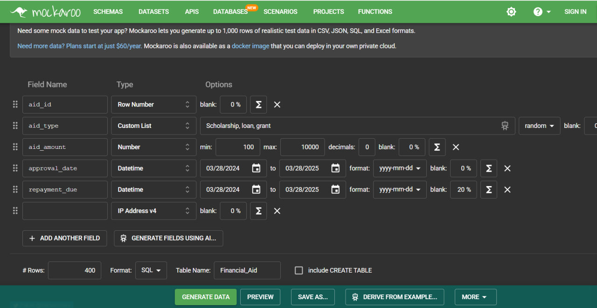

### ✅ Method C: Generatedata  


---

## 💾 Backup & Restore

### Backup  


### Restore  


---

---

# 📘 Stage 2 – Advanced SQL Queries & Constraints

This section includes documentation and screenshots for advanced SQL queries (SELECT, DELETE, UPDATE) and constraint handling as required in Stage 2.

---

## 📊 SELECT Queries

> A total of 8 SELECT queries were implemented. Each query is described and accompanied by screenshots of the query and its result (up to 5 rows).

### 🔍 SELECT 1: Total payments per student per year
Shows how much each student paid in total each year.
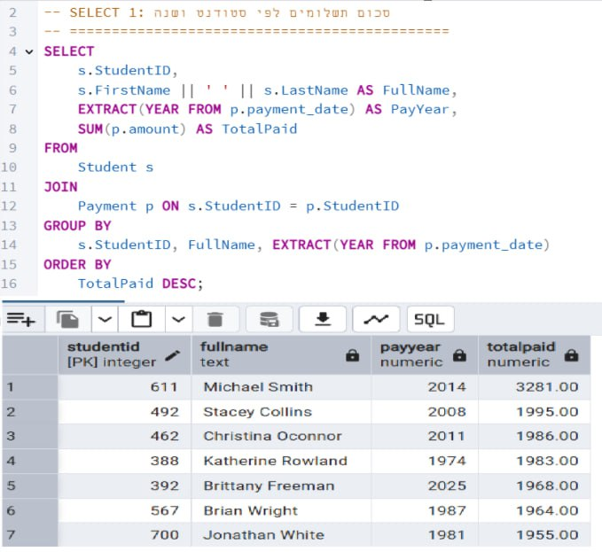

### 🔍 SELECT 2: Monthly income summary from payments
Calculates total income grouped by month and type of payment.
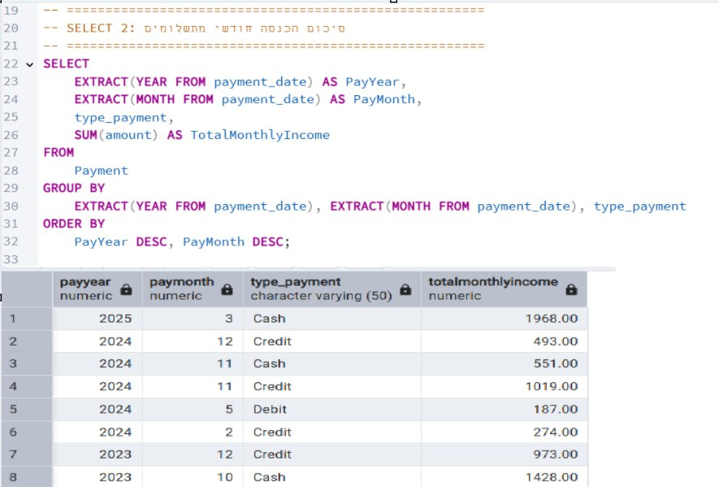

### 🔍 SELECT 3: Payments in the last month
Retrieves recent payments including payment type and topic.
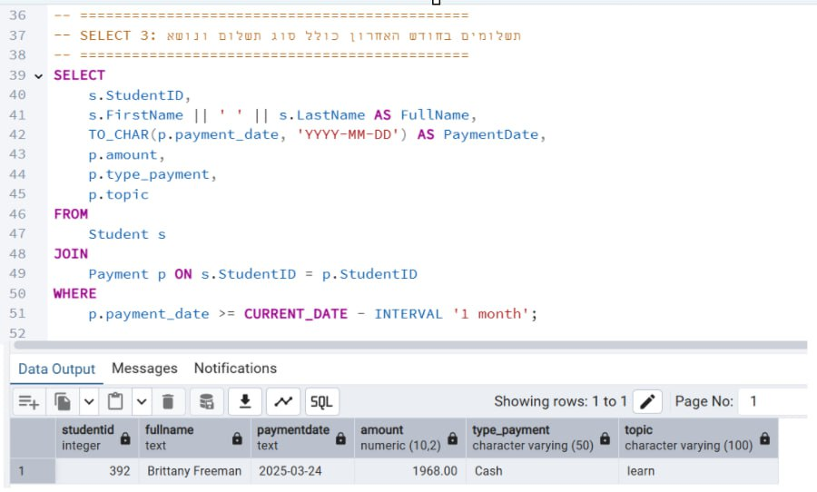

### 🔍 SELECT 4: Departments with total budgets over 50,000
Displays departments that have received significant funding.
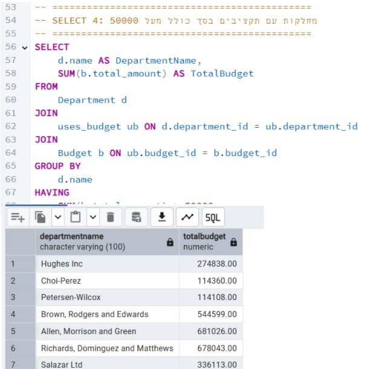

### 🔍 SELECT 5: Employees by hire year and department
Gives insight into employees, their hiring date and salary.
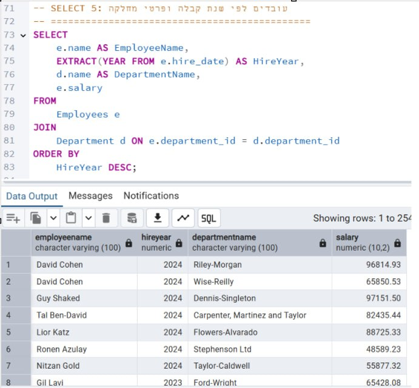

### 🔍 SELECT 6: Average payment amount by type
Shows statistical data about payment types.
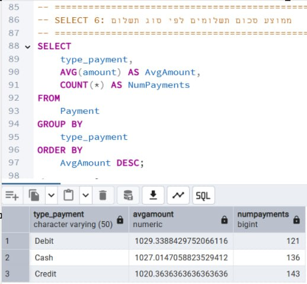

### 🔍 SELECT 7: Students receiving aid but no scholarship
Highlights financially struggling students.
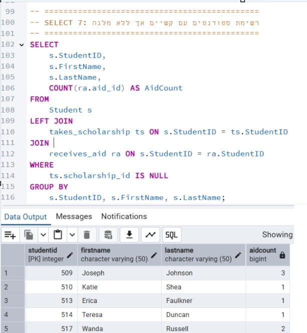

### 🔍 SELECT 8: Highest scholarship granted per year
Displays top scholarship per year based on approval date.
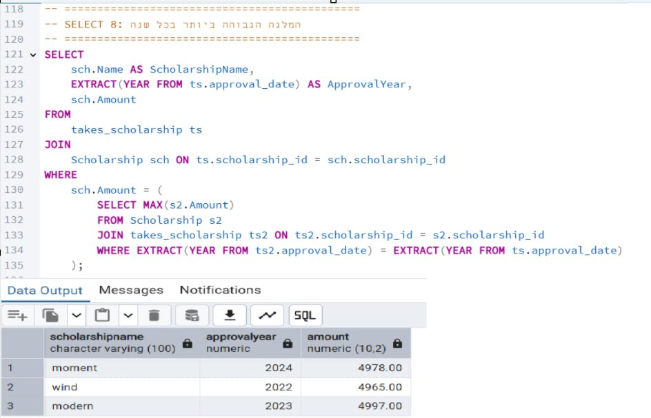

---

## 🗑️ DELETE Queries

> Each DELETE query includes a description, the SQL code, and screenshots showing the database **before and after** the deletion.

### ❌ DELETE 1: Old small payments (older than 2 years, below average)
Removes outdated, small-value transactions.
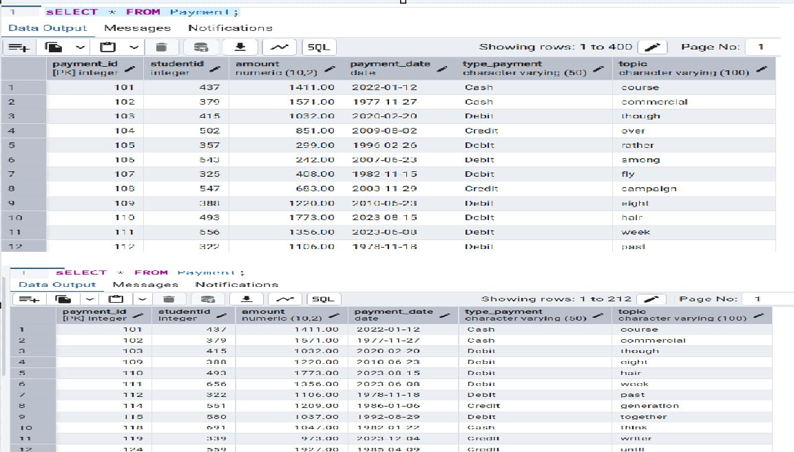

### ❌ DELETE 2: Employees earning between 70,000 and 90,000
Used to clean up high-salary ranges.
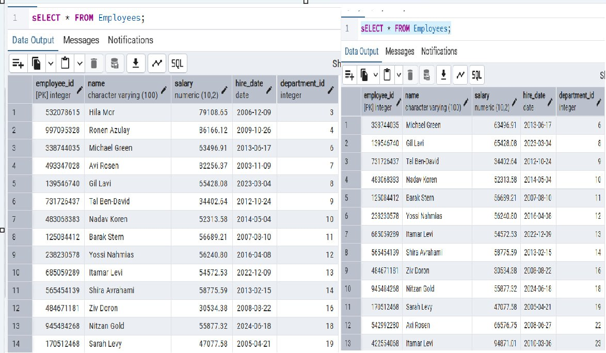

### ❌ DELETE 3: Scholarships with low hour requirements (Cascade delete)
Requires modifying a foreign key to include ON DELETE CASCADE.
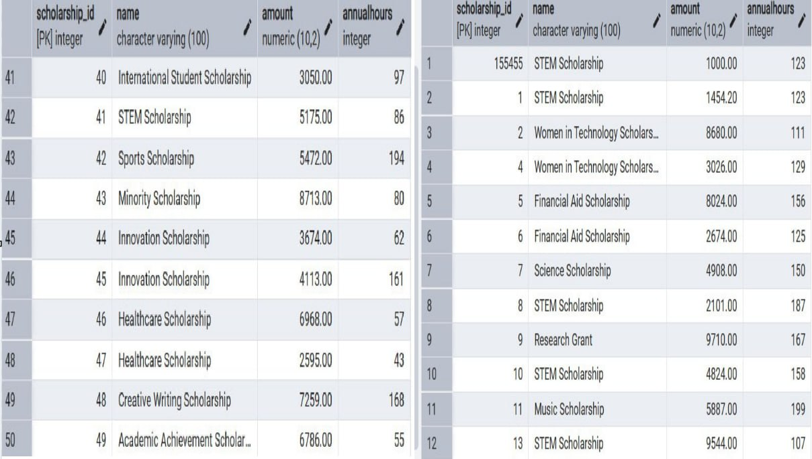

---

## 🔄 UPDATE Queries

> Each UPDATE query includes the purpose, SQL code, and screenshots showing the **before and after** state of the data.

### ✏️ UPDATE 1: Reduce employee salary by 80% for low-budget departments
Targets departments with a total budget below 100,000.
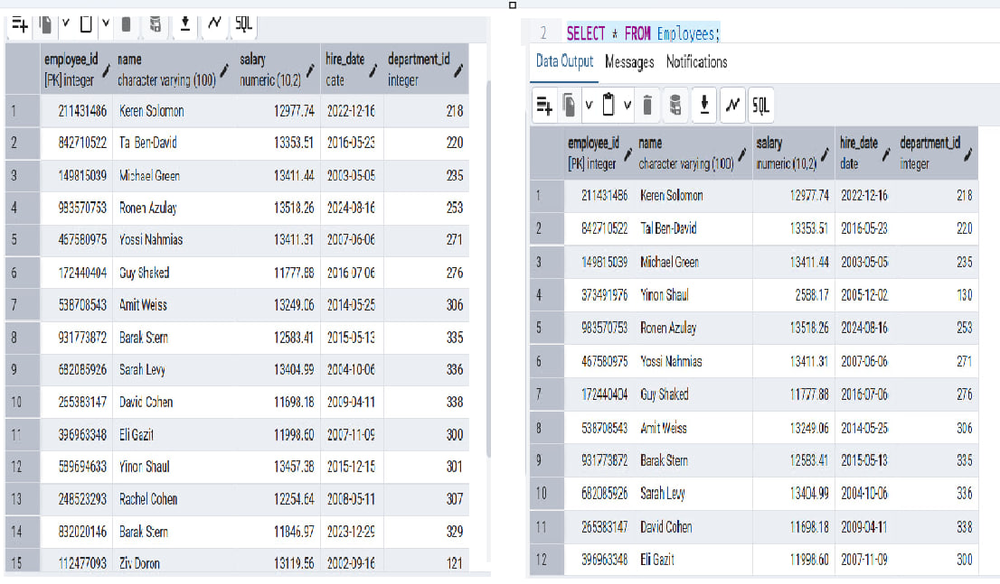

### ✏️ UPDATE 2: Raise scholarship by 10% based on average payments
Dynamically adjusts scholarship if payment average is higher.
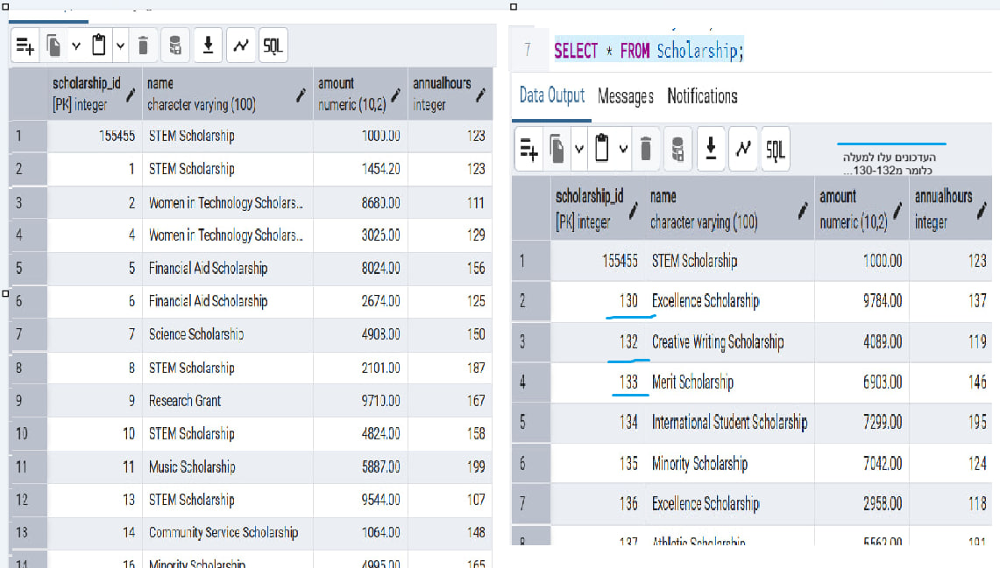

### ✏️ UPDATE 3: Add "israel-" prefix before '@' in student emails
Used string manipulation to improve email consistency.


---

## 🔐 Constraints Using `ALTER TABLE`

> Each constraint added with `ALTER TABLE` is documented below, including an attempt to violate it and the resulting error message.

### 🔧 Constraint 1: ON DELETE CASCADE for `takes_scholarship`
Ensures that deleting a scholarship also deletes associated records in `takes_scholarship`.

#### ✔️ Alter Command
```sql
ALTER TABLE takes_scholarship
DROP CONSTRAINT takes_scholarship_scholarship_id_fkey,
ADD CONSTRAINT takes_scholarship_scholarship_id_fkey
FOREIGN KEY (scholarship_id) REFERENCES Scholarship(scholarship_id) ON DELETE CASCADE;

---


---
